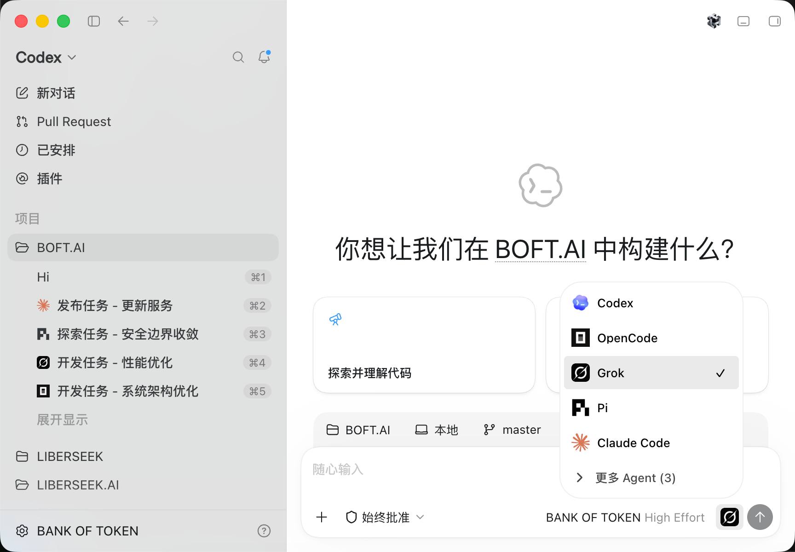
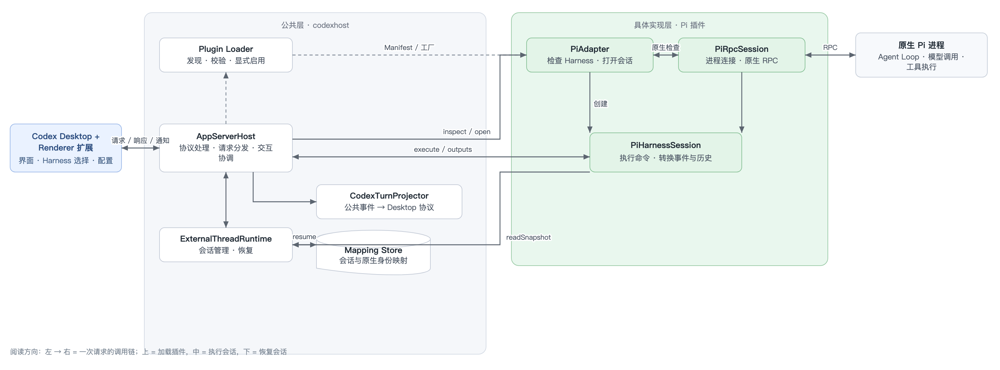

<div align="center">

# BOFT CLI

**Run Pi and other Harnesses inside Codex Desktop**

We believe **Codex Desktop** currently provides the best desktop development experience.

But **Codex** is not the only capable **Agent Harness**. Some people prefer **Claude Code** or **Pi Agent**.

**BOFT CLI** lets you choose the **Agent** that actually executes your tasks inside **Codex Desktop**, while preserving the native Codex experience and letting those Agents work together.

⭐ If this project helps you, please give it a Star! ⭐

<p>
  <a href="https://opensource.org/licenses/MIT"></a>
  <a href="https://linux.do"></a>
</p>

<p>
  <a href="https://pi.dev/"></a>
  <a href="https://openai.com/codex/"></a>
  <a href="https://code.claude.com/docs/en/quickstart"></a>
  <a href="https://opencode.ai/docs/"></a>
  <a href="https://github.com/deepseek-ai/deepseek-harness"></a>
  <a href="https://grok.com/"></a>
  <a href="https://github.com/can1357/oh-my-pi"></a>
  <a href="https://antigravity.google/product/antigravity-cli"></a>
</p>

<p align="center">
  <sub><a href="../README.md">简体中文</a> · English · <a href="README.ko.md">한국어</a></sub>
</p>
</div>

<p align="center">
  <strong>Quick navigation:</strong>
  <a href="#interface-preview">Interface preview</a> •
  <a href="#quick-start">Quick start</a> •
  <a href="#feature-status">Feature status</a> •
  <a href="#cross-agent-collaboration">Cross-Agent collaboration</a> •
  <a href="#remote-harness">Remote</a> •
  <a href="#development">Development</a>
</p>


## Interface Preview

No app switching required: **Pi, Claude Code, OpenCode, OMP, Grok Build, and DeepSeek Harness** can all run directly in the same Codex Desktop window.

### Interface

<div align="center">
  
</div>

## Quick Start

**Use npm**

> Supports macOS, Windows, and [x64/ARM64 Linux](linux.md).

```bash
npm install -g @liberseek/boft-cli
boft
```

**Or download** [installers](https://github.com/LiberSeek/BOFT-CLI/releases) (macOS, Windows)

<details>
<summary>Installation troubleshooting</summary>

**macOS** - Apple verification issue

If the app cannot be verified when you first open it, run:

```bash
xattr -dr com.apple.quarantine /Applications/codexhost.app
```

Then run `boft` again. `codexhost` remains available as a compatibility alias.

**Windows** - Portable/extracted Codex Desktop

If you use a portable build, set `CODEXHOST_INSTALL_ROOT` to the extracted Codex Desktop directory:

```powershell
[Environment]::SetEnvironmentVariable("CODEXHOST_INSTALL_ROOT", "D:\CodexPortable", "User")
```

Fully quit Codex Desktop, open a new terminal, and run `boft`.

</details>

### Interaction examples

<table>
  <tr>
    <td width="50%" valign="top">
      <p><strong>Agent and Model selection</strong></p>
      
    </td>
    <td width="50%" valign="top">
      <p><strong>Usage and cost information</strong></p>
      
    </td>
  </tr>
  <tr>
    <td colspan="2" valign="top">
      
      <p>The macOS menu bar icon and Windows taskbar icon show the remaining allowance percentage, preferring the five-hour window and falling back to the seven-day window.</p>
    </td>
  </tr>
  <tr>
    <td colspan="2" valign="top">
      <p><strong>Mermaid diagram rendering</strong></p>
      <div align="center">
        
      </div>
    </td>
  </tr>
</table>

## Feature Status

| Capability | <a href="https://openai.com/codex/"></a> | <a href="https://pi.dev/"></a> | <a href="https://github.com/can1357/oh-my-pi"></a> | <a href="https://code.claude.com/docs/en/quickstart"></a> | <a href="https://opencode.ai/docs/"></a> | <a href="https://grok.com/"></a> | <a href="https://github.com/deepseek-ai/deepseek-harness"></a> | <a href="https://antigravity.google/product/antigravity-cli"></a> |
| --- | --- | --- | --- | --- | --- | --- | --- | --- |
| Streaming responses | Native | ✅ | ✅ | ✅ | ✅ | ✅ | ✅ | ✅ |
| Tool status | Native | ✅ | ✅ | ✅ | ✅ | ✅ | ✅ | ✅ |
| Edit Diff | Native | ✅ | ✅ | ✅ | ✅ | ✅ | ✅ | — |
| Questions / cancellation | Native | ✅ | — / ✅ | ✅ | ✅ | ✅ | ✅ | — / ✅ |
| Model / Thinking selection | Native | ✅ | ✅ | ✅ | ✅ | ✅ | ✅ | ✅ |
| Tool approvals | Native | ✅ | — | ✅ | ✅ | ✅ | ✅ | — |
| Permission modes | Native | — | ✅ | ✅ | ✅ | ✅ | ✅ | ✅ |
| Cross-Agent task collaboration | ✅ | ✅ | ✅ | ✅ | ✅ | ✅ | ✅ | ✅ |
| Usage | Native | ✅ | ✅ | ✅ | ✅ | ✅ | ✅ | ✅ |
| Fork | Native | ✅ | ✅ | ✅ | ✅ | ✅ | ✅ | ✅ |
| Context compaction | Native | ✅ | ✅ | ✅ | ✅ | ✅ | ✅ | — |
| Slash commands | Native | ✅ | ✅ | ✅ | ✅ | ✅ | ✅ | ✅ |
| Edit previous message | Native | ✅ | ✅ | ✅ | ✅ | ✅ | ✅ | ✅ |

> **Antigravity current status:** Integration is still being completed. The working directory is currently fixed to `~/.gemini/antigravity-cli/scratch`.

## Cross-Agent collaboration

You can ask the current Agent to hand an independent task to another Harness. For example:

> Ask `claude-code` to review this change independently and point out compatibility risks.
>
> Ask `pi` to investigate why this test fails intermittently.
>
> Ask `omp` to implement this feature while I continue working on the documentation.
>
> Ask `opencode` to verify this fix in an independent Thread and run the related tests.

BOFT CLI creates a separate Native Session for the target Harness. The delegated session appears in the Codex Desktop conversation list, where you can open it, inspect progress, or continue the conversation.

<details>
<summary><h3 id="remote-harness">Remote Harness</h3></summary>

Use Harnesses on remote nodes within Codex Desktop on your local machine, executing tasks on remote machines while continuing to use Codex Desktop’s unified interface. Both ends need to install the same BOFT CLI version.

**Two connection methods are supported:**

#### 1️⃣ SSH remote (recommended for Mac/Linux servers)

Connect to and control Harnesses on other development nodes over SSH. This requires Codex Desktop’s native SSH workspace.

| Client ↓ / Remote Host → | macOS | Linux | Windows |
| --- | --- | --- | --- |
| macOS | ✅ | ✅ | ❌ |
| Linux | ✅ | ✅ | ❌ |
| Windows | ✅ | ✅ | ❌ |

On the SSH remote host, run:

```bash
npm install -g @liberseek/boft-cli
boft remote install
boft remote start
boft remote status
```

Then start Codex Desktop through local `boft`, open the SSH workspace, and choose the target Harness in the remote composer’s Agent/Model selector.

[SSH setup, diagnostics, and uninstall →](remote-ssh-host.md)

#### 2️⃣ Remote Control remote (experimental · recommended for Windows)

When Windows is the controlled Host, you can keep Codex Desktop’s official pairing, account authentication, and relay, and use Harnesses on Windows from the Codex Desktop of another paired computer. Official Remote Control must already be able to run native Codex tasks.

This path does not add a public service or TCP port. Harness credentials remain on the controlled Windows machine.

[Remote Control setup, transport boundary, and diagnostics →](remote-control-host.md)

</details>

<details>
<summary><h3>How it works</h3></summary>

Most multi-agent clients connect different Harnesses through the [ACP](https://agentclientprotocol.com/) protocol. Integration is fast, but native capabilities such as tools, approvals, permissions, diffs, and questions are first flattened.

BOFT CLI takes a different approach:

- **Desktop side:** Use CDP / Electron Inspector to enhance Agent selection and the session UI on official Codex Desktop. The chat shell is not rebuilt, and the official installer is not modified.
- **Protocol side:** Use a CLI Shim to transparently connect to the official app-server; Codex requests are forwarded unchanged.
- **Harness side:** Integrate each Harness through its native interface. Pi uses official RPC, Claude Code uses the Agent SDK / CLI, then results are projected into Desktop’s existing streaming output, tools, diffs, approvals, and questions.
- **Orchestration side:** Create a separate Native Session and regular writable Thread for the delegated Harness, and store the delegation relation separately. Creation and result observation stay separate, so the initiator explicitly chooses to read, wait, or leave the task running in the background.

The goal is fidelity, not merely making the conversation work. Streaming, tool status, reliable patches, native approvals, and questions should come from the Harness itself whenever possible, rather than being guessed or fabricated by the Host.

</details>

## Development

Requirements: official Codex Desktop, Node.js 22.19+ or 24, and Rust.

```bash
git clone https://github.com/BytePioneer-AI/codex-host
cd codex-host
npm ci
npm start
```

### Runtime architecture

Using Pi as the example. Left to right is one request’s call chain: Desktop → shared layer → Pi plugin → native process.

<div align="center">
  
</div>

### Adding a Harness

The main work is implementing the plugin Manifest, factory, Adapter, Session, and the native communication and conversion logic. The Renderer still has some static wiring, so full Desktop integration needs additional work.
When adding a Harness, you can have a coding Agent use the in-repo [codexhost-add-harness Skill](../.agents/skills/codexhost-add-harness/SKILL.md). It covers plugin structure, the public Adapter interface, capability implementation, and test requirements.

## Acknowledgements

- Thanks to the [LINUX DO](https://linux.do/) community for its continued support.
- Thanks to the [Paseo](https://github.com/getpaseo/paseo) project for inspiring and informing the multi-Harness integration approach and architecture.
- Thanks to the [Codexhost](https://github.com/BytePioneer-AI/codex-host) project for inspiration and reference.
